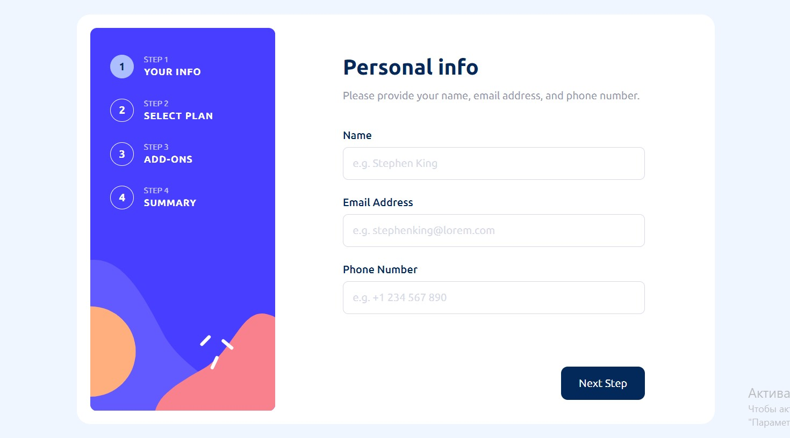

# Frontend Mentor - Multi-step form solution

This is a solution to the [Multi-step form challenge on Frontend Mentor](https://www.frontendmentor.io/challenges/multistep-form-YVAnSdqQBJ). Frontend Mentor challenges help you improve your coding skills by building realistic projects. 

## Table of contents

- [Overview](#overview)
  - [The challenge](#the-challenge)
  - [Screenshot](#screenshot)
  - [Links](#links)
- [My process](#my-process)
  - [Built with](#built-with)
  - [Project Commands](#project-commands)
  - [What I learned](#what-i-learned)
- [Author](#author)

**Note: Delete this note and update the table of contents based on what sections you keep.**

## Overview

### The challenge

Users should be able to:

- Complete each step of the sequence
- Go back to a previous step to update their selections
- See a summary of their selections on the final step and confirm their order
- View the optimal layout for the interface depending on their device's screen size
- See hover and focus states for all interactive elements on the page
- Receive form validation messages if:
  - A field has been missed
  - The email address is not formatted correctly
  - A step is submitted, but no selection has been made

### Screenshot



### Links

- Solution URL: [https://github.com/eldrssn/multi-step-form](https://github.com/eldrssn/multi-step-form)
- Live Site URL: [https://multi-step-form-eldrssn.vercel.app/](https://multi-step-form-eldrssn.vercel.app/)

## My process

### Built with

- Semantic HTML5 markup
- CSS custom properties
- Flexbox
- [React](https://reactjs.org/) - JS library
- [SCSS](https://sass-lang.com/) - For styles
- [Formik](https://formik.org/) - For creating forms
- [Jest](https://jestjs.io/) - For testing
- [React Testing Library](https://testing-library.com/docs/react-testing-library/intro/) - For testing

### Project Commands

- Run the application in development mode:
```
npm run dev
```

- Build the project:
```npm run build```

- Launch Vite preview for the build: 
```npm run preview```

- Run tests with coverage report and detailed information:
```npm test```

### What I learned

In the process of developing this project, I learnt and refined a lot of issues related to testing React applications, using Jest and the React Testing Library. 

- Writing tests using Jest and React Testing Library.
- Using render and various testing methods such as fireEvent.
- Using waitFor to wait for asynchronous actions.
- Using userEvent to emulate user actions such as text input and clicks.
- Writing tests for components that use Formik.
- Using toMatchSnapshot to create and update snapshots of components.
- Creating and using context in React.
- Testing context-dependent components.
- Approach naming and organising tests according to functionality.

## Author

- Website - [Maxim Kalimullin](https://maxkalimullin.vercel.app/)
- Frontend Mentor - [@eldrssn](https://www.frontendmentor.io/profile/eldrssn)
- LinkedIn - [@maxkalimullin](https://www.linkedin.com/in/maxkalimullin/)
